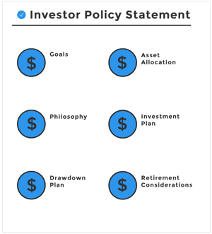

Hello there!

As I was binge reading some of [Mr. RIP](https://retireinprogress.com/){:target="_blank"}'s older posts, I stumbled upon his "**Monthly Learning Journal**" blog series, which I thoroughly enjoyed. In a nutshell, he used to **share what he learned** during the previous month.

Since **I consume a lot of content** like YouTube videos, blog posts, and essays, I thought it would be a good idea to start my own learning journal. But unlike Mr. RIP's monthly schedule, I'll be sharing my discoveries **on a less regular basis**, for the time being.

Typically, when I come across ineteresting content, I jot down my thoughts and notes in my trusty **"second brain"** (I use [LogSeq](https://logseq.com/){:target="_blank"}). This makes it relatively effortless to compile and share them here. This commitment allows me to fuse two of my greatest passions: **learning and sharing**!

### Table of contents

* [Renting vs Buying a Home: The 5% Rule, Ben Felix](#renting-vs-buying-a-home-the-5-rule-ben-felix)
* [FAQ on How to become an idea machine, James Altucher](#faq-on-how-to-become-an-idea-machine-james-altucher)
* [Investor Policy Statement](#investor-policy-statement) (multiple sources)
* [Writing and Speaking, Paul Graham](#writing-and-speaking-paul-graham)
* [Proof You Can Do Hard Things, Nat Eliason](#proof-you-can-do-hard-things-nat-eliason)

---

## Renting vs. Buying a Home: The 5% Rule, Ben Felix

<iframe 
    width="420" 
    height="315"
    src="https://www.youtube.com/embed/q9Golcxjpi8" 
    frameborder="0" 
    allowfullscreen>
</iframe>

**TL;DR**: while renting might seem like a waste of money, **buying** a house **comes with** significant **unrecoverable costs** as well. According to Ben Felix (and his geographical biase), this accounts for an **yearly 5%** of the property value, that includes:

* 1% for **property taxes**
* 1% for **maintenance costs**
* 3% for the **cost of capital**

Thus, if you can find an **annual rent that's lower than 5%** of the hypothetical budget you'd use to buy a house, renting may actually be a **more financially efficient** choice.

The **cost of capital** reflects the gap between the expected returns in the stock market versus the housing market. Therefore, it is **highly subjective** and it is closely tied to the **opportunity cost**. Can you invest in the stock market and earn those returns? If your alternative would be to hide the money under the mattress, buying might be a more appealing option!

This reminds me the [**"list of countries by home ownership rate"**](https://www.statista.com/statistics/246355/home-ownership-rate-in-europe/){:target="_blank"}. Could it be **related to the financial literacy**? I can speak for Italy (ownership of 73.7% in 2021), where the [financial literacy is quite low](https://www.bancaditalia.it/statistiche/tematiche/indagini-famiglie-imprese/alfabetizzazione/index.html?com.dotmarketing.htmlpage.language=1){:target="_blank"}, and most people still firmly believe on the "high power of the brick"..

## [FAQ on How to become an idea machine](https://jamesaltucher.com/blog/faq-on-how-to-become-an-idea-machine/){:target="_blank"}, James Altucher

**TL;DR**: James Altucher proposes a daily practice for becoming an "idea machine". The core idea is quite simple and straightforward: **write down 10 ideas every day** on any topic, starting from a theme. For instance, you can brainstorm 10 potential blog post ideas or 10 ways you waste time each day. 

Despite the somewhat clickbaity title, this practice is intriguing. **I've personally committed to a 30-day challenge** of idea generation and I am looking forward to it!

## Investor Policy Statement
* [Investment policy statement](https://www.bogleheads.org/wiki/Investment_policy_statement){:target="_blank"}, John Bogle 
* [My investor policy statement](https://retireinprogress.com/ips/){:target="_blank"}, Mr Rip
* [You Need an Investor Policy Statement](https://www.physicianonfire.com/you-need-an-investor-policy-statement/){:target="_blank"}, PhysicianOnFire

{:refdef: style="text-align: center;"}

{: refdef}
> [Source](https://www.physicianonfire.com/you-need-an-investor-policy-statement/){:target="_blank"}

**TL;DR**: An **Investor Policy Statement** (IPS) is a comprehensive document that outlines your investment goals, strategies, and philosophy. It serves as a guiding framework for your investment decisions.

For a week or so, I entered in a tiny **rabbit hole** of IPS, and I find it especially valuable. Until now, I've been following a straightforward strategy of **buying and holding a World [ETF](https://www.justetf.com/it/etf-profile.html?isin=IE00BYX2JD69){:target="_blank"}** (100% stocks) with a long-term horizon, ideally for my retirement. Therefore, I didn't pay much attention to asset allocation and portfolio adjustments.

However, I've often thought: "What should my strategy be for the **next 20 years**? How do I gradually shift my portfolio from 100% stocks to 60% or 80%?" Despite some random thoughts and notes, I haven't planned too extensively.

Now, contemplating the idea of creating my own IPS, it's clear that I should do my homework and start approaching my financial planning in a more structured way! 

## [Writing and Speaking](http://paulgraham.com/speak.html){:target="_blank"}, Paul Graham

**TL;DR**: Paul Graham discusses the differences between being a good speaker and being a good writer. He argues that having good ideas is crucial for **good writing**, while being a **good speaker** relies less on ideas and more on the ability to **engage the audience**. Thus, ***some*** **good speakers may not** necessarily **provide substantial content**.

> *"It was a revelation to me how **much less ideas mattered in speaking than writing** [...] **Being a really good speaker is not merely orthogonal to having good ideas, but in many ways pushes you in the opposite direction.**"*

> *"All the time you **spend practicing a talk,** you could **instead** **spend making it better**"*

> *"The way to get the attention of an audience is to **give them your full attention**, and when you're delivering a **prewritten talk**, **your attention is always divided** between the audience and the talk — even if you've memorized it. If you want to engage an audience, it's better to start with no more than an outline of what you want to say and ad lib the individual sentences. But if you do that, you might spend no more time thinking about each sentence than it takes to say it."*

## [Proof You Can Do Hard Things](https://blog.nateliason.com/p/proof-you-can-do-hard-things){:target="_blank"}, Nat Eliason

**TL;DR**: Nat Eliason emphasizes the **importance of mastering hard things**, explaining that conquering one difficult activity can potentially **make it less intimidating to master new ones**, particularly from a mental perspective.

I know that it might sound like a cliché, but **that's why I enjoy sports**. I'm not into competing with others; I prefer challenging myself. If I run a 5k faster today, I'll surely try to beat that time next week or in the next session!

Then, once you realize you can exceed your own limits, you can apply that mindset to any activity, whether it's mental or physical.

> *"**The more hard things you push yourself to do, the more competent you will see yourself to be**."*

> *"This is also why **there’s so much survivorship bias and bad advice in the “C students hire A students” trope**. Most C students are not doing other hard things instead of school. But **some C students are getting C’s because they’re obsessed with other projects. Hard projects.**"*