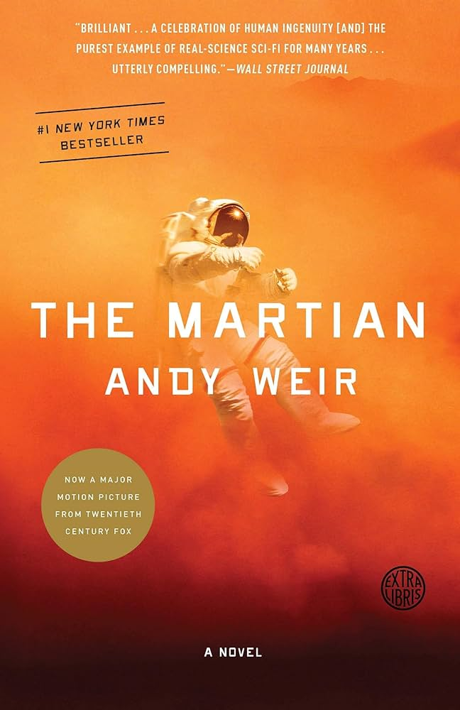

I knew I wanted to write something about the books I read in 2023, but I was not sure about the format. A couple of lines for each of the books, or something more extended for just a couple of them? Finally, I decided to go for the second one! Therefore, below you can find five of my favorite books of 2023, in no particular order. 

Selecting those five books was quite a hard choice. Therefore, I would also give an honorable mention to:
* **Building a second brain**, *Tiago Forte*
* **Dark matter**, *Blake Crouch*
* **Dopamine nation**, *Anna Lembke*

### Table of contents

* [A man's search for meaning, Viktor Frankl](#a-mans-search-for-meaning-viktor-frankl)
* [The obstacle is the way, Ryan Holiday](#the-obstacle-is-the-way-ryan-holiday)
* [The martian, Andy Weir](#the-martian-andy-weir)
* [Grit: the power of passion and perseverance, Angela Duckworth](#grit-the-power-of-passion-and-perseverance-angela-duckworth)
* [Deep work, Cal Newport](#grit-the-power-of-passion-and-perseverance-angela-duckworth)

---

### A man's search for meaning, Viktor Frankl

{: .book-img-right}

Despite its fame, I wasn't familiar with this book until I bought it, and it turned out to be quite fascinating. The book is about the **observations of Viktor Frankl**, a **neurologist and psychiatrist** who survived **Auschwitz and Dachau's Nazi concentration camps**.

Among the survivors, he observed a recurring pattern: everyone had a **driving force, a purpose in life**. It could be anything, like a beloved spouse, an unfinished book, or an ongoing scientific discovery. 

This relentless **search for meaning** is at the core of the human being, no matter what life throws at you. This forms the foundation of **logotherapy**, a new form of therapy developed by Viktor Frankl. Based on the existential analysis, logotherapy aims to find our meaning in life, providing a reason to rise above our sufferings.

While having a purpose is important to be "successful" in life, as emphasized by Angela Duckworth (see below), I found the perspective offered by logotherapy quite inspiring. Beyond mere success, a clear purpose guides you toward an intentional life and, unfortunately at times, serves as a reason to combat our daily suffering.

Three quotes (out of many) that are worth reflecting on. 

> *"They must not lose hope but should keep their courage in the certainty that hopelessness of our struggle did not detract from its dignity and its meaning. I said that someone looks down on each of us in difficult hours - a friend, a wife, somebody alive or dead, or a God - and he would not expect us to disappoint him. He would hope to find us suffering proudly - not miserably, knowing how to die."*

> *"The meaning of life always changes, but it never ceases to be."*

> *"Happiness cannot be pursued. One must have a reason to "be happy". Once the reason is found, however, one becomes happy automatically. As we see, a human being is not one in pursuit of happiness but rather in search for a reason to become happy."*

### The obstacle is the way, Ryan Holiday

{: .book-img-right}

I've always found the philosophy of stoicism intriguing, and nowadays, Ryan Holiday is probably one of its major advocates. 

The core idea in "The obstacle is the way" is to **embrace obstacles**, and **turn them into advantages**. While many people tend to be paralyzed by obstacles, a minority seeks to extract the maximum benefit from them.

Personally, I don't feel like a stoic yet, but on the other hand, I tend to rationally face obstacles. Based on the context, I do sometimes "panic" as well, but I would say it does happen less often. 

Anyway, the framework proposed by Ryan Holiday is made of three pieces: perception, action, and will. **Perception** defines how we view and interpret events, determining whether they are obstacles or opportunities. **Action** involves the steps we take to overcome obstacles. Lastly, we must maintain our **willpower** to persist and endure, preparing for the worst.  Regardless of the outcome, we have to learn and grow from any experience we face.

I do believe that overcoming challenges creates a kind of **bubble effect**. As you become more aware and confident in your "will" and "actions," you encounter less friction and are less likely to panic when facing the next challenge.

And remember.. 

> *"After all, you're probably not going to die from any of this."*

### The martian, Andy Weir

{: .book-img-right}

"The Martian" by Andy Weir likely needs no introduction. In a nutshell, Mark Watney, the **protagonist, is left stranded on Mars** after a dust storm forces his crew to evacuate, presuming him dead. Watney leverages his scientific knowledge to survive, growing potatoes using Martian soil and creating a makeshift communication system.

The book is a must-read, filled with **entertainment, suspense, and humor**. I couldn't have imagined a stranded astronaut being so funny!

### Grit: the power of passion and perseverance, Angela Duckworth

{: .book-img-right}

This book delves into the concept of **grit**, defined by Angela Duckworth as **a personal trait characterized by strong passion, perseverance, and dedication to a specific goal**. In a world often fixated on the notions of "genius" or "innate talent," Duckworth's work demystifies the roots of success.

She simplifies it into two equations:

$$\text{talent} \times \text{effort} = \text{skill} \\ \text{skill} \times \text{effort} = \text{achievement}$$

So, what's the takeaway? **Effort counts twice**! The more we engage in deliberate practice, the more our skills develop, reducing the impact of initial talent.

> To put it in somewhat nerdy terms, it brings to mind **Bayesian statistics**. Our talent acts as the prior belief, and effort resembles our likelihood or sample size. As we practice more (increasing our sample size), the significance of talent (prior belief) diminishes.

Lastly, she emphasizes the importance of a **clear purpose** to cultivate grit. Identifying our work as personally fulfilling and connected to the well-being of others is key. The author suggests to **write it down into less than 10 words**. Though somewhat naive, my current purpose can be summarized as:

<i>
Develop explainable and reliable AI to improve people's lives
</i>

However, not entirely satisfied, I formulated a more elaborate purpose. It's been a real motivator during my current PhD journey, especially when things get tough or my motivation takes a hit!

### Deep work, Cal Newport

{: .book-img-right}

Cal Newport's 'Deep Work' is likely a familiar title for many. The book centers around the concept of **deep work**, essentially, the art of working without distractions. Newport defines it as *"professional activities performed in a state of distraction-free concentration that push your cognitive capabilities to their limit"*. This stands in contrast to shallow work, the mindless tasks easily done while being distracted.

Throughout the book, Cal Newport stresses the importance of mastering deep work for **knowledge workers**. It's not just about maximizing problem-solving skills, but also staying up to date in today's evolving market, which constantly demands learning new technologies or discoveries.

I believe that cultivating the ability to engage in deep work is a trainable skill, but it needs integration into our routines, **compatible with our attitude and habits**. Personally, as an early bird, I start my day quite early, dedicating most part of the morning to deep work. To me, this is the time of the day in which I feel most focused and productive. Then, as my productivity and stamina decrease, I shift toward shallow activities. 

For those who enjoy tracking their progress, keeping tabs on pomodoros or deep work sessions can be quite satisfying. I began with a Google spreadsheet, but now I mark them with red crosses on my research daily agenda (thanks to [Charlotte Fraza](https://www.youtube.com/watch?v=ktVK9m_lVsY)). Despite the seemingly simple trait, I appreciate it because it gives the impression that I am progressing in my work. During the Ph.D., short-term accomplishments are rare, and quantifying daily or weekly progress is not always easy. Thus, this little diary helps me stick to the commitment.

---

> *Disclaimer: the images are taken from amazon.de*