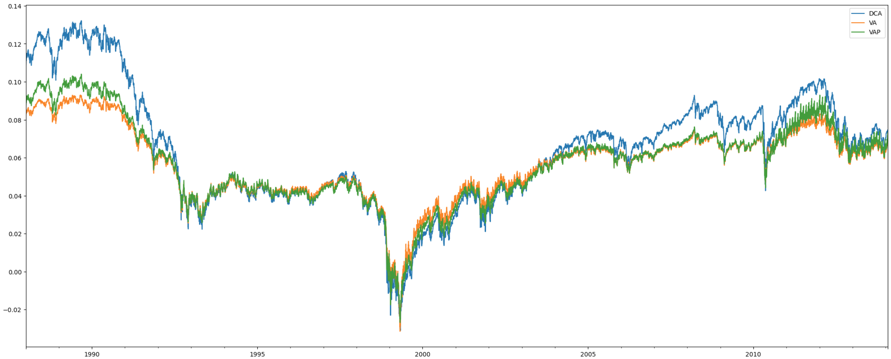
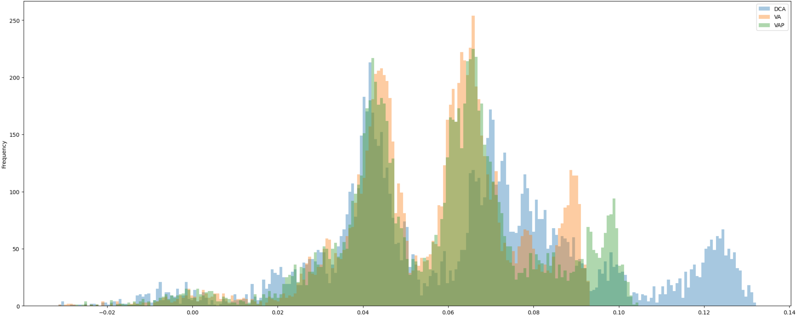

<small>Update from 2024/02/08</small>

Prof. Paolo Coletti got to Pietro's video (below) before I had the chance to, as seen on his YouTube [video](https://www.youtube.com/watch?v=HJjWWiOwOhQ). I was planning to run some simple Monte Carlo experiments using Python.

But, Prof. Coletti did a thorough job before me, and he shared his work in a [Colab notebook](https://colab.research.google.com/drive/1qkohEX0efo5j_fE0vsg91rthLOzJ99WM?usp=sharing). His analysis was more comprehensive than what I had in mind. So, lucky me that I came across his great work!

The following chart might look a bit confusing at first. It plots the final return on the y-axis and the initial investment date on the x-axis, but it doesn't really show time progression (kinda). It suggests that, in most cases, a DCA strategy works better.

When we look closer, especially during strong bull markets, we see higher returns with DCA (blue line). This is because we keep investing the same amount, whereas with VA, we invest less. So, the takeaway for me is, since I'm in it for the long term and expecting positive returns, I shouldn't invest less during high points.

From a "frequency" point of view, DCA still comes out on top with the highest returns. Both findings have convinced me and my friend S.R. to stick with DCA for our long-term investments!

--- 

 

<iframe 
    width="420" 
    height="315"
    src="https://www.youtube.com/embed/D0aYa3Vbb0Q" 
    frameborder="0" 
    allowfullscreen>
</iframe>

While Dollar Cost Averaging remains a safe choice for accumulating ETFs, considering the monthly **market volatility** might lead to a more nuanced approach. 

**Dollar Cost Averaging** (DCA) involves investing a **fixed amount monthly**. This allows to buy slightly more stocks while market downturns and slightly less stocks while the market goes up. Conversely, a **Value Averaging** (VA) strategy define the **monthly value increase of the portfolio**, which is subject to the current and previous porfolio values. 

> Assume a desired monthly increase of 1000 euros. If your portfolio goes up by 700 euros (because of the market), invest 300 euros. If it goes down by 500 euros, invest 1500 euros.

This strategy is quite appealing to me, but I would like to **modify** it based on my view and financial plans. Specifically, since the **market is typically bullish** in the **long-term**, I think we might loose significant long term profits if we invest much less or even worse, we have to sell. 

> Considering the previous experiment, if the portfolio grows by 1500 euros, we should sell 500 euros of stocks. 

While talking to a friend (S.R.), we both agreed on this view, and we are currently thinking about setting a **"minimum" investment**, regardless of market movements, in order to not lose long-term profits. The specific percentage for this minimum investment is still under consideration. We planned to have fun with some spreadsheets or Monte Carlo simulations. Let's see how it turns out! 